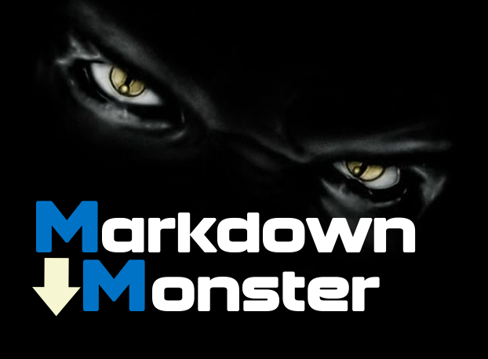
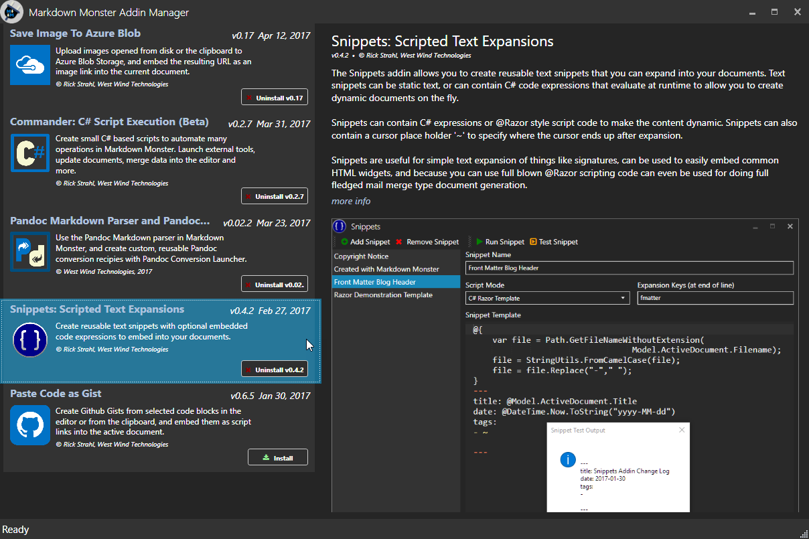
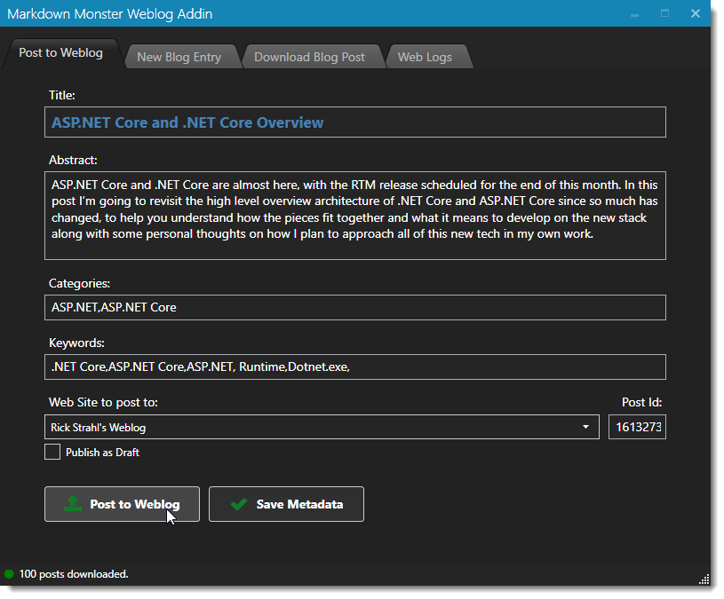
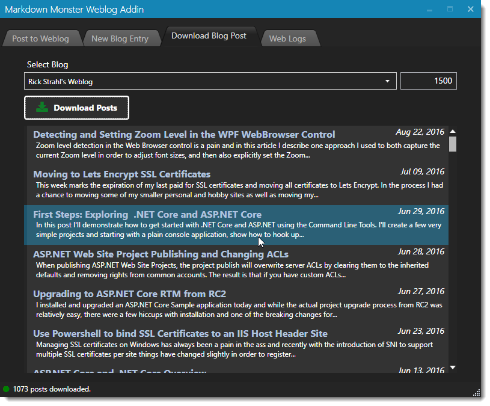



# Markdown Monster
#### An extensible Markdown Editor, Viewer and Weblog Publisher for Windows

## Links
* **[Markdown Monster Site](http://markdownmonster.west-wind.com)**
* **[Download](http://markdownmonster.west-wind.com/download.aspx)**
* **[Install from Chocolatey](https://chocolatey.org/packages/MarkdownMonster)**
* **[Video: Getting Started with Markdown Monster](https://www.youtube.com/watch?v=XjFf57Ap9VE)**  
* **[Follow @MarkdownMonstr on Twitter](https://twitter.com/markdownmonstr)**
* **[Documentation](https://markdownmonster.west-wind.com/docs/)**
* **[Create Addins with .NET](http://markdownmonster.west-wind.com/docs/_4ne0s0qoi.htm)**
* **[Markdown Monster Addin Registry](https://github.com/RickStrahl/MarkdownMonsterAddinsRegistry)**  
* **[Bug Reports & Feature Requests](https://github.com/rickstrahl/MarkdownMonster/issues)**
* **[Discussion Forum](http://support.west-wind.com?forum=Markdown+Monster)**
* **[Change Log](Changelog.md)**
* 

Here's what Markdown Monster looks like:

## Features
Markdown Monster provides many useful features:

#### Markdown Editor
* Syntax highlighted Markdown editing
* Live Markdown HTML preview 
* Easily customizable, HTML preview templates
* Gentle toolbar support for Markdown newbies
* Inline spell checking
* Customizable editor and editor themes
* Support for many common file types
* Edited HTML files preview HTML
* Save Markdown output to HTML
* Paste HTML text as Markdown
* Copy Markdown editor selection as HTML

#### Editing Features
* Syntax colored Markdown text
* Easily select and embed images
* Easily capture screen shots and embed the images
* Embed code snippets and see highlighted syntax coloring
* Text Snippet Expansion with C# Code via Snippets Addin

#### Weblog Publisher
* Create or edit Weblog posts using Markdown
* Publish your posts to your blog (MetaWebLog,Wordpress)
* Download and edit existing posts
* Very fast publish and download process
* Publish to and remember multiple blogs
* Optional Dropbox post storage

#### Extensibility
* Create Addins with .NET code
* Simple interface, easy to implement
* Access the UI, buttons, active document
* Access document and application lifecycle events
* Two useful plugins are provided:
* Screen capture addin (SnagIt and custom tool)
* Weblog publishing addin (MetaWebLog and Wordpress)

#### Non Markdown Features
* HTML file editing with live preview
* Many other file formats can also be edited:  
JSON, XML, CSS, JavaScript, Typescript, FoxPro, CSharp and more
* Open document folder or console 

Please **star this repo** if you use Markdown Monster and you like what you see here. Please help spread the word.

## Why another Markdown Editor?
Markdown is everywhere these days, and it's becoming a favorite format for many developers, writers and documentation experts to create lots of different kinds of content in this format. Markdown is used in a lot of different places:

* Source Code documentation files (like this one)
* Weblog posts
* Product documentation
* Message Board message entry
* Application text entry for formatted text

Personally I use Markdown for my Weblog, my message board, of course on GitHub and in a number of applications that have free form text fields that allow for formatted text - for example in our Webstore product descriptions are in Markdown. 

Having an editor that gets out of your way, yet provides a few helpful features **and lets you add custom features** that make your content creation sessions more productive are important. The ability to easily publish your Markdown to any MetaWebLog API endpoint is also useful as it allows you to easily publish to blogs or applications that allow for meta data uploads.

### Markdown Monster wants to eat your Markdown!
Markdown Monster is a Markdown editor and Viewer for Windows that lets you create edit or simple preview Markdown text. It provides basic editing functionality with a few nice usability features for embedding links, code, images and screen shots. It works great, but nothing revolutionary here. You get a responsive text editor that's got you covered with Markdown syntax highlighting, an collapsible live preview, so you can see what your output looks like, inline spellchecking and a handful of optimized menu options that help you mark up your text and embed and link content into your Markdown document.

### Customizable
Most features are optional and can be turned on and off. Want to work distraction free and see no preview or spell checking hints? You can turn them off. 

Want a different editor theme than the dark default or a preview theme that matches your blog or branding? You can easily switch to one of the many built-in editor themes, or for previews use either one of several built-in themes or create your own with a simple, plain HTML/CSS template. You can even link in your online styles.

The editor and previewer are HTML and JavaScript based, so you can also apply any custom styling and even hook up custom JavaScript code if you want to get fancy beyond the basic configurability. The preview themes are easy to modify HTML and CSS templates, so if you need to create a custom format so it matches your application's style it's quite easy to create a custom Preview theme or simply reference an online style sheet.

## Extensible with .NET Add-ins
But the **key feature** and the main reason I built this tool, is that it is **extensible**, so that you and I can plug additional functionality into it. Markdown Monster includes an add-in model that lets you add buttons to the UI, interact with the active document and the entire UI and attach to life cycle event to get notifications of various application events like documents opening and closing, documents being saved and the application shutting down, etc..

You can find documentation for creating Addins here:

* [Creating a Markdown Monster Addin](http://markdownmonster.west-wind.com/docs/_4ne0s0qoi.htm)
* [Markdown Monster Addin Visual Studio Project Template](https://marketplace.visualstudio.com/items?itemName=RickStrahl.MarkdownMonsterAddinProject)
* [Accessing and Manipulating the Active Editor](http://markdownmonster.west-wind.com/docs/_4nf02q0sz.htm)
* [Bringing up UI from your Addin](http://markdownmonster.west-wind.com/docs/_4ne1ch7wa.htm)

### Markdown Monster Addin Registry
You can create addins for your own use, simply by copying them into the Addins folder, or if you created an Addin that you think might be useful for others you can publish on the Markdown Monster Addin Registry. The registry holds public Addins that show in the Addin Manager inside of Markdown Monster:

You can find out more on how to publish your Addins in this GitHub repository:

* [Markdown Monster Addin Registry](https://github.com/RickStrahl/MarkdownMonsterAddinsRegistry)

Right now the registry is pretty sparse, but here are a couple of Addins you can check out:

* [Save Image to Azure Blob Storage](https://github.com/RickStrahl/SaveToAzureBlob-MarkdownMonster-Addin)
* [Paste Code as Gist](https://github.com/RickStrahl/PasteCodeAsGist-MarkdownMonster-Addin)
* [Snippets](https://github.com/RickStrahl/Snippets-MarkdownMonster-Addin)

## Provided Add-ins
Not only does Markdown Monster allow extension via Addins - it also uses Addins for some built-in features. Specifically the Screen Capture the Weblog Publishing modules are implemented as Add-ins and demonstrate the power of the Add-in model.

#### Screen Capture Addin
The Screen Capture add-in supports two separate capture modes: Using Techsmith's popular and super versatile [SnagIt](http://techsmith.com/snagit) Screen Capture utility (which I **highly** recommend!) or using an integrated less featured Screen Capture module that allows capturing for Windows desktop windows and objects. To capture, simply click the capture button (camera icon) and the main app minimizes and either SnagIt or the integrate screen capture tool pops up to let you select the object to capture. You can preview and edit your captures, and when finished the captured image is linked directly into content.

Here's the **SnagIt Screen Capture** in action:

> Due to a confirmed bug in SnagIt 13's automation interface, SnagIt 13 currently does not work with Markdown Monster. Version 12 and older work fine, but if you're only using SnagIt 13 you have to temporarily resort to using the built-in screen capture tool. TechSmith is aware of the issue and have promised a fix in an upcoming patch release.

If you don't have SnagIt installed or you simply prefer a more light weight but less full featured solution, you can use the **built-in Screen Capture** that's a native part of Markdown Monster and doesn't require any external software:

#### WebLog Addin
Writing long blog posts is one thing I do a lot of and this is one of the reasons I actually wanted an integrated solution in a Markdown editor. You can take any Markdown and turn it into a blog post by using the Weblog add-in. Click the Weblog button on the toolbar and set up your blog (MetaWebLog or WordPress), and then specify the Weblog specifics like title, abstract, tags and Web Site to publish to. You can also download existing blog posts from your blog and edit them as Markdown (with some conversion limitations) and then republish them.

  
  

### Other Add-ins - What do you want to build?
I can think of a few add-in ideas - a quick way to commit to Git and Push would be useful for documentation solutions, or Git based blogs, so you can easily persist changes to a GitHub repository. Embedding all sorts of content like reference links, AdSense links, Amazon product links, a new post template engine, etc., etc.

Or maybe you have custom applications that use Markdown text and provide an API that allows you to post the Markdown (or HTML) to the server. It's easy to build a custom add-in that lets you take either the Markdown text or rendered HTML and push it to a custom REST interface in your custom application.

## Acknowledgements
This application heavily leans several third party libraries without which this tool would not have been possible. Many thanks for the producers of these libraries:

* **[Ace Editor](https://ace.c9.io)**  
Ace Editor is a power HTML based editor platform that makes it easy to plug syntax highlighted software style editing possible in a browser. Markdown Monster uses Ace Editor for the main Markdown editing experience inside of a Web browser control that interacts with the WPF application.

* **[MarkDig Markdown Parser](https://github.com/lunet-io/markdig)**  
This extensible Markdown parser library is used for the rendering Markdown to HTML in Markdown Monster. The library is fast and supports a number of useful extensions like GitHub Flavored Markdown, table support, auto-linking and various add-on protocols. The feature set is extensible via a plug-in pipeline. 

* **[MahApps.Metro](http://mahapps.com/)**  
This library provides the Metro style window and theming support of the top level application shell. It's an easy to use library that makes it a snap to build nice looking WPF applications.

* **[Dragablz](https://dragablz.net/)**  
This library provides the tab control support for the editor allowing for nicely styled tab reordering and overflow. The library also supports tab tear off tabs and layout docking although this feature is not used in Markdown Monster.

* **[nHunspell Spell Checking](http://www.crawler-lib.net/nhunspell)**  
Spell checking is handled via the hunspell library and the .NET wrapper in nhunspell. This library checks for mispellings and provides lookups for misspelled words. Word parsing is done in JavaScript and the spell checking is done in .NET by piping word lists to .NET to check which is drastically faster than doing the spell checking in the browser using JavaScript.

## Spread the Word about Markdown Monster
If you like Markdown Monster please pass it on to help spread the word. Let your friends know, mention it to others who ask about Markdown and help us grow this community to encourage building the best Markdown Editor around.

Here are a few things you can do to help spread the word:

* **Follow us on Twitter**: [@MarkdownMonstr](https://twitter.com/markdownmonstr)
* **Tweet about Markdown Monster** and mention [@MarkdownMonstr](https://twitter.com/markdownmonstr)
* **Star this repo** by clicking on the Star icon in the header
* **Install from Chocolatey** with the [Markdown Monster Package](https://chocolatey.org/packages/MarkdownMonster)
* **Write an Addin**: [Create a Markdown Monster Addin](http://markdownmonster.west-wind.com/docs/_4ne0s0qoi.htm)
* **Write a blog post** and mention how you use Markdown Monster
* **Link to the [Markdown Monster Web Site](https://markdownmonster.west-wind.com)** to help us spread the Google Foo.

The support from the community so far with feedback, bug reports and ideas for new features has been awesome, and I look forward for that to continue with a growing community of active users and contributors.

## License
Although we provide the source in the open, Markdown Monster is licensed software &copy; West Wind Technologies, 2016-2017.

Markdown Monster can be downloaded and evaluated for free, but a [reasonably priced license](http://store.west-wind.com/product/MARKDOWN_MONSTER) must be purchased for continued use. Licenses are **per user**, rather than per machine, so an individual user can use Markdown Monster on as many computers they wish with their license. <a href="https://store.west-wind.com/product/markdown_monster_site">Organization licenses</a> are also available.

Thanks for playing fair.

#### Contribute - get a Free License
Contributors that provide valuable feedback, help out with code or support Markdown Monster in a significant way are eligible for a free license. Contact [Rick for more info](http://west-wind.com/contact/).

## Warranty Disclaimer: No Warranty!
IN NO EVENT SHALL THE AUTHOR, OR ANY OTHER PARTY WHO MAY MODIFY AND/OR REDISTRIBUTE 
THIS PROGRAM AND DOCUMENTATION, BE LIABLE FOR ANY COMMERCIAL, SPECIAL, INCIDENTAL, OR CONSEQUENTIAL DAMAGES ARISING OUT OF THE USE OR INABILITY TO USE THE PROGRAM INCLUDING, BUT NOT LIMITED TO, LOSS OF DATA OR DATA BEING RENDERED INACCURATE OR LOSSES SUSTAINED BY YOU OR LOSSES SUSTAINED BY THIRD PARTIES OR A FAILURE OF THE PROGRAM TO OPERATE WITH ANY OTHER PROGRAMS, EVEN IF YOU OR OTHER PARTIES HAVE BEEN ADVISED OF THE POSSIBILITY OF SUCH DAMAGES.

&copy; Rick Strahl, West Wind Technologies, 2016
